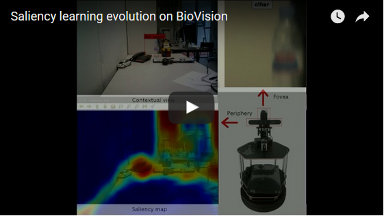

# RL-IAC

This is the repository for the RL-IAC project. The source code is not released yet, but in the meantime, you can watch some result videos or refer to a few articles describing the proposed method.

## Videos

### Saliency learning on the BioVision platform

Saliency learning on the foveated system called "BioVision". Learning is made possible through an object classifier applied to the foveal image. When an object is detected in the fovea, the visual aspect of this object is used to update the saliency model that is applied in the contextual image.

### Saliency learning on a mobile robot

Another approach for learning saliency on a mobile robot. This time, objects are detected based on a depth-segmentation technique. Similarly, the information provided by the object detector is used as a learning signal to update the saliency model.

### Bounding box proposals

Bounding box proposals results and comparison with the top ranked EdgeBoxes on the same image. Our bounding boxes are obtained from depth segmentation (SegBoxes), and EdgeBoxes. In both cases, these boxes are associated with a saliency-consistency score (based on the produced saliency map) that provides a good confidence score for selecting or rejecting a bounding box proposal. 

### Region creation and simulation

A focus on the way regions are constructed in RL-IAC. For now, our method works in two steps: first, the robot quickly covers the environment to build a reliable map and constructs regions accordingly. Second, displacement are performed based on this map to create a model of saliency. 

### Progress evolution and region selection

An illustration of the action selection procedure with the IAC algorithm. In this case, regions are portions of a video sequence, and an action represents the selection of a particular frame in this sequence. Each region has a local estimation of the error the saliency model is doing. This measure of the error is used to obtain the learning progress. This measure is then used to select frames for updating the saliency model.

### IAC on BioVision

A video displaying the exploration based on IAC on the BioVision platform: regions are defined in the pan-tilt space, where each positions corresponds to a foveal observation. This observation is used as a learning signal through object recognition and a saliency model is progressively updated and improved. To explore the environment methodically, the robot uses a local measure of the learning progress and samples observations in the most progressing regions.

## Publications
### Thesis
* Celine Craye, *Intrinsic Motivation Mechanisms for Incremental Learning of Visual Saliency*. [PDF File](https://www.researchgate.net/publication/317332909_Intrinsic_motivation_mechanisms_for_incremental_learning_of_visual_saliency)

### Conferences
* Craye, C., Filliat, D. & Goudou, J.F. (2015). *Apprentissage incrémental de la saillance visuelle pour des applications robotique*, sciencesconf.org:orasis2015:55355. [PDF file](https://hal.archives-ouvertes.fr/hal-01161848/file/V3ORASIS.pdf)
* Craye, C., Filliat, D. & Goudou, J.F. (2015). *Exploration Strategies for Incremental Learning of Object-Based Visual Saliency*. ICDL-EPIROB-The fifth joint IEEE International Conference on Development and Learning and on Epigenetic Robotics, At Providence, RI, USA. [PDF file](https://hal.archives-ouvertes.fr/hal-01170532/file/ICDL_celine_craye_final.pdf)
* Craye, C., Filliat, D. & Goudou, J.F. (2016). *Environment Exploration for Object-Based Visual Saliency Learning*. Robotics and Automaton (ICRA), 2016 IEEE International Conference on, At Stockholm, Sweden. [PDF file](https://hal.archives-ouvertes.fr/hal-01289159/file/root.pdf)
* Craye, C., Filliat, D. & Goudou, J.F. (2016). *RL-IAC: An autonomous exploration policy for online saliency learning on a mobile robot*. In 2016 IEEE/RSJ International Conference on Intelligent Robots and Systems (IROS). [PDF file](https://hal.archives-ouvertes.fr/hal-01392947/file/root.pdf)
* Craye, C., Filliat, D. & Goudou, J.F. (2016). *On the Use of Intrisic Motivation for Visual Saliency Learning*. ICDL-EPIROB-The sixth joint IEEE International Conference on Development and Learning and on Epigenetic Robotics, At Cergy Pontoise, France. [PDF file](https://hal.archives-ouvertes.fr/hal-01370850/document) 

### Journals

## Authors
* Celine Craye, former PhD Student at [ENSTA Paristech](https://www.ensta-paristech.fr/) and research engineer at [Thales](www.thalesgroup.com) SIX in the Vision and Sensing group
* [David Filliat](http://perso.ensta-paristech.fr/~filliat/fr/), professor at [ENSTA Paristech](https://www.ensta-paristech.fr/) and member of the [INRIA FLOWERS](https://flowers.inria.fr) team
* Jean-François Goudou, project manager at [Thales](www.thalesgroup.com) SIX in the Vision and Sensing group